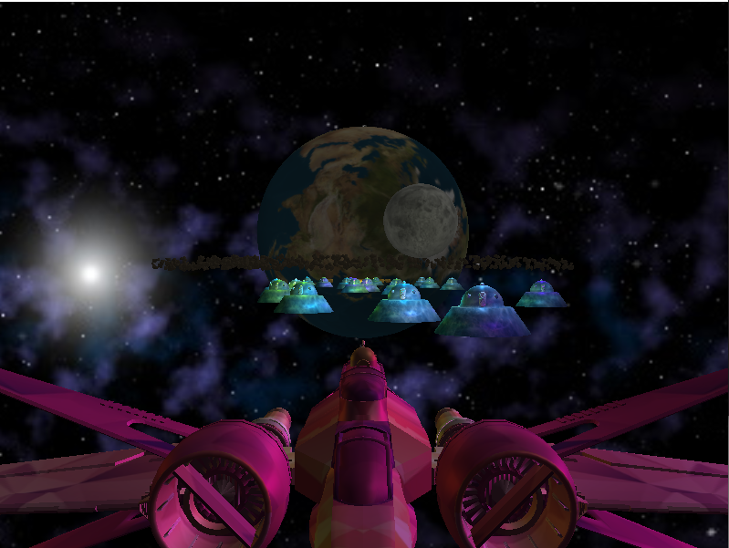
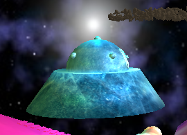
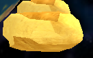
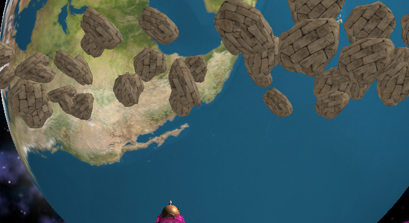
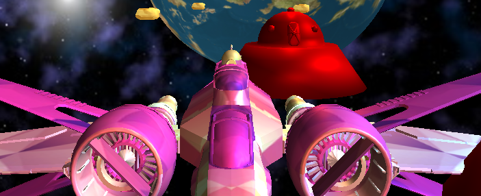
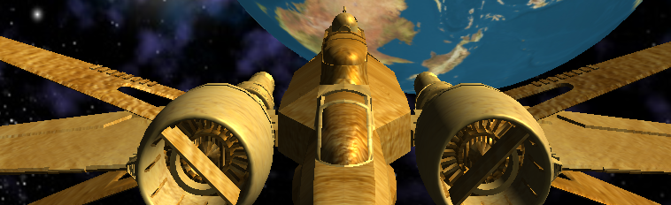
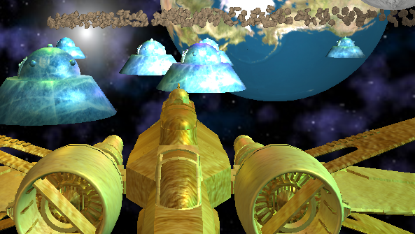
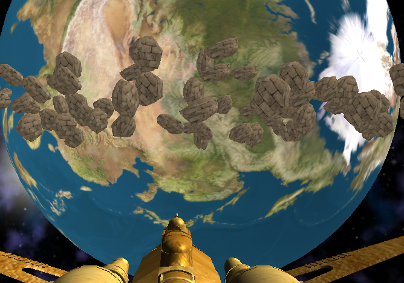

# learn opengl

### 1.整个场景

### 2.提供对每种对象的基本灯光渲染结果的近距离观察的帧。 

### 3. 显示航天器（1）向当地车辆发出警报，（2）收集金牌，（3）收集后改变航天器纹理的框架。 

### 4. 可以表示您已实现的任何奖励功能的框架。 

另一个光源

法线贴图

### 5. 对您的实现细节进行一些简短而必要的描述。

巡逻的飞船发现航天器会发出警报并不在移动

可以按下enter键改变巡逻飞船的移动速度

收集金子及收集完毕有音效

鼠标左键可以开关环境光，右键开关航天器的灯光